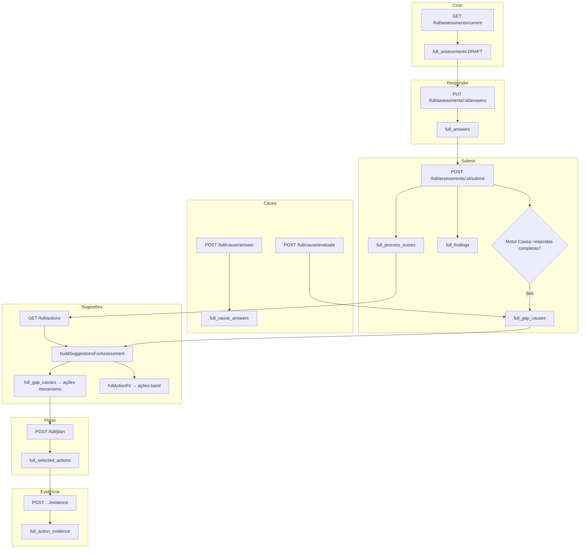

# FULL Root Cause Engine — Inventário Técnico e Ponto de Encaixe

**Objetivo:** Mapear onde o FULL calcula gaps/scores, gera recomendações e persiste dados; definir o ponto exato de inserção do Root Cause Engine.

**Regras fixas:** DB soberano, determinismo, gates existentes, evidência write-once. IA não classifica causa no MVP.

---

## 1. Fluxo atual vs fluxo alvo

### Fluxo atual (ASCII)

```
┌─────────────────────────────────────────────────────────────────────────────────┐
│ FLUXO FULL ATUAL                                                                 │
├─────────────────────────────────────────────────────────────────────────────────┤
│                                                                                  │
│  1. CRIAR/OBTER ASSESSMENT                                                       │
│     GET /full/assessments/current  ou  POST /full/assessments/start              │
│     → full_assessments (DRAFT)                                                   │
│                                                                                  │
│  2. SALVAR RESPOSTAS (draft)                                                     │
│     PUT/POST /full/assessments/:id/answers                                        │
│     → full_answers                                                               │
│                                                                                  │
│  3. SUBMIT                                                                       │
│     POST /full/assessments/:id/submit                                             │
│     → valida completude                                                           │
│     → calcula score/banda por processo → full_process_scores                      │
│     → status = SUBMITTED                                                         │
│     → [OPCIONAL] Motor de Causa: se full_cause_answers completas → full_gap_causes │
│     → buildAndPersistFindings → full_findings (3 vazamentos + 3 alavancas)       │
│                                                                                  │
│  4. RESULTADOS (raio-x)                                                          │
│     GET /full/results  ou  GET /full/assessments/:id/results                      │
│     → loadFullResultsPayload (scores + findings)                                  │
│                                                                                  │
│  5. SUGESTÕES / RECOMENDAÇÕES                                                    │
│     GET /full/actions                                                            │
│     → buildSuggestionsForAssessment:                                            │
│        a) full_gap_causes → ações por mecanismo (cause engine)                    │
│        b) fullActionFit.deriveSuggestionsFromAnswers → ações por band/respostas  │
│                                                                                  │
│  6. PLANO 30d (3 ações)                                                          │
│     POST /full/assessments/:id/plan/select  ou  POST /full/plan                   │
│     → full_selected_actions                                                      │
│                                                                                  │
│  7. EVIDÊNCIA (write-once)                                                       │
│     POST /full/assessments/:id/plan/:action_key/evidence                         │
│     → full_action_evidence                                                       │
│                                                                                  │
│  8. CICLO FECHADO / NOVO CICLO                                                    │
│     POST /full/assessments/:id/close  → status = CLOSED                           │
│     POST /full/assessments/:id/new-cycle → full_cycle_history + reabre SUBMITTED  │
│                                                                                  │
└─────────────────────────────────────────────────────────────────────────────────┘
```

### Fluxo alvo (Gap → Causa → Mecanismo → Ação)

```
┌─────────────────────────────────────────────────────────────────────────────────┐
│ FLUXO ALVO: GAP → CAUSA → MECANISMO → AÇÃO → EVIDÊNCIA                          │
├─────────────────────────────────────────────────────────────────────────────────┤
│                                                                                  │
│  GAP (full_process_scores LOW)                                                   │
│       ↓                                                                          │
│  CAUSA (full_cause_answers + full_gap_causes)                                    │
│       ↓                                                                          │
│  MECANISMO (cause_engine.v1.json → mechanism_actions por gap)                      │
│       ↓                                                                          │
│  AÇÃO (sugestão com cause_label, why)                                             │
│       ↓                                                                          │
│  PLANO (full_selected_actions)                                                    │
│       ↓                                                                          │
│  EVIDÊNCIA (full_action_evidence, write-once)                                    │
│                                                                                  │
│  O Motor de Causa JÁ está inserido:                                              │
│  - full_cause_answers: respostas LIKERT_5 por gap                                 │
│  - full_gap_causes: causa primária + evidências (scoreCause + persistGapCause)    │
│  - buildSuggestionsForAssessment: lê full_gap_causes e emite ações por mecanismo│
│                                                                                  │
└─────────────────────────────────────────────────────────────────────────────────┘
```

### Diagrama Mermaid (fluxo simplificado)



---

## 2. Tabela: Arquivo → Papel no fluxo

| Arquivo / Rota | Papel no fluxo |
|----------------|----------------|
| **apps/api/src/lib/fullAssessment.js** | `getOrCreateCurrentFullAssessment`: cria/obtém assessment DRAFT ou SUBMITTED |
| **apps/api/src/routes/full.js** | Rotas FULL: assessment, answers, submit, results, actions, plan, evidence |
| **apps/api/src/routes/full.js** | `handleAnswersUpsert`: salva respostas em `full_answers` (DRAFT) |
| **apps/api/src/routes/full.js** | `POST /full/assessments/:id/submit`: valida, calcula scores, persiste findings, opcionalmente avalia causa |
| **apps/api/src/routes/full.js** | `scoreToBand`, `deriveBandFromCanonical`: score → banda (LOW/MEDIUM/HIGH) |
| **apps/api/src/routes/full.js** | `buildAndPersistFindings`: gera 3 vazamentos + 3 alavancas → `full_findings` |
| **apps/api/src/routes/full.js** | `loadFullResultsPayload`: carrega scores + findings para raio-x |
| **apps/api/src/routes/full.js** | `buildSuggestionsForAssessment`: causa (full_gap_causes) + FIT (fullActionFit) |
| **apps/api/src/routes/full.js** | `GET /full/actions`: retorna sugestões (requer SUBMITTED) |
| **apps/api/src/routes/full.js** | `POST /full/assessments/:id/plan/select`, `POST /full/plan`: persiste plano em `full_selected_actions` |
| **apps/api/src/routes/full.js** | `POST .../plan/:action_key/evidence`: evidência write-once em `full_action_evidence` |
| **apps/api/src/lib/causeEngine.js** | `loadCauseCatalog`, `scoreCause`, `persistGapCause`, `getCauseAnswersByGap`, `getGapCause` |
| **apps/api/src/lib/fullActionFit.js** | `deriveSuggestionsFromAnswers`: sugestões por band + sinais (respostas baixas) |
| **apps/api/src/lib/fullResultCopy.js** | Textos cliente: `getOQueEstaAcontecendo`, `getCustoDeNaoAgir`, etc. |
| **catalogs/full/cause_engine.v1.json** | Catálogo: gaps, cause_questions (LIKERT_5), rules (weights), mechanism_actions |

---

## 3. Tabelas/entidades DB relacionadas ao ciclo FULL

| Tabela | Papel |
|-------|-------|
| **full_assessments** | Ciclo FULL: id, company_id, status (DRAFT/SUBMITTED/CLOSED), segment |
| **full_answers** | Respostas do diagnóstico (process_key, question_key, answer_value 0–10) |
| **full_process_scores** | Score e banda por processo (score_numeric, band LOW/MEDIUM/HIGH) |
| **full_findings** | 3 vazamentos + 3 alavancas (payload, trace, is_fallback) |
| **full_cause_answers** | Respostas LIKERT_5 por gap (assessment_id, gap_id, q_id, answer) |
| **full_gap_instances** | Gaps detectados no submit (assessment_id, gap_id, status: CAUSE_PENDING | CAUSE_CLASSIFIED) |
| **full_gap_causes** | Causa primária/secundária por gap (cause_primary, evidence_json, score_json) |
| **full_selected_actions** | Plano 30d: 3 ações (action_key, position, owner_name, metric_text, checkpoint_date, status) |
| **full_action_evidence** | Evidência write-once (before_baseline, after_result, declared_gain) |
| **full_action_dod_confirmations** | Confirmação DoD antes de DONE |
| **full_cycle_history** | Histórico de planos fechados (exclui ações já executadas das sugestões) |
| **full_consultant_notes** | Notas do consultor por ação |
| **full_process_catalog** | Catálogo de processos |
| **full_question_catalog** | Catálogo de perguntas |
| **full_action_catalog** | Catálogo de ações (process_key, band, action_key, title, dod_checklist) |

---

## 4. Ponto de inserção do Root Cause Engine

### Candidatos

| Candidato | Descrição | Prós | Contras |
|-----------|-----------|------|---------|
| **A** | Após `submit`, antes de `buildAndPersistFindings` | Causa disponível antes dos findings | Findings não usam causa hoje (raio-x é band-based) |
| **B** | Após `submit`, dentro de `buildSuggestionsForAssessment` | Sugestões já consomem causa | — |
| **C** | Antes de `GET /full/actions` (on-demand) | Só avalia quando necessário | Duplicação de lógica; ações precisam de causa persistida |

### Escolha final

**Ponto de inserção:** Após `submit` do diagnóstico FULL (quando score/banda já existe) e antes de `recommendations/actions/suggestions`.

**Implementação atual (já existente):**

1. **Submit** (`POST /full/assessments/:id/submit`):
   - Calcula scores → `full_process_scores`
   - Atualiza status → SUBMITTED
   - **Se** `full_cause_answers` completas para gaps MVP → avalia e persiste em `full_gap_causes`

2. **Sugestões** (`GET /full/actions` → `buildSuggestionsForAssessment`):
   - Lê `full_gap_causes` → emite ações por mecanismo (cause → mechanism_actions)
   - Lê `full_answers` + `full_process_scores` → fullActionFit emite ações por band

3. **Respostas de causa** (fluxo paralelo ao diagnóstico):
   - `POST /full/cause/answer` → `full_cause_answers`; atualiza `full_gap_instances.status` para CAUSE_CLASSIFIED quando última pergunta respondida
   - `POST /full/cause/evaluate` → `scoreCause` + `persistGapCause` → `full_gap_causes`

4. **Validação de plano** (`POST /full/plan`):
   - Quando há causas classificadas (`full_gap_causes`), exige pelo menos 1 ação de `mechanism_required_action_keys`
   - 400 `MECHANISM_ACTION_REQUIRED` com `mechanism_action_keys` se não cumprido

**Ordem garantida:** Score/banda existe antes de qualquer sugestão. Causa é avaliada quando respostas LIKERT existem. Sugestões só retornam após SUBMITTED. Plano exige ação do mecanismo quando causa classificada.

---

## 5. Confirmação: DB como fonte de verdade

| Entidade | Evidência em código |
|----------|---------------------|
| **Causa** | `full_gap_causes` — `persistGapCause` em `causeEngine.js`; `buildSuggestionsForAssessment` lê de `full_gap_causes` |
| **Mecanismo** | `cause_engine.v1.json` → `mechanism_actions` por gap; sem campo aberto de causa |
| **Plano 30d** | `full_selected_actions` — insert em `POST /full/plan` e `POST /full/assessments/:id/plan/select` |
| **Evidência** | `full_action_evidence` — UNIQUE(assessment_id, action_key), write-once; FK para full_selected_actions |

**Regras respeitadas:**
- Nenhuma recomendação inventada: sugestões vêm de catálogo (cause engine ou fullActionFit)
- Causa 100% determinística: `scoreCause` usa weights + tie_breaker do catálogo
- Evidência write-once: constraint UNIQUE e validação na rota

---

## 6. Resumo executivo

- **Fluxo:** DRAFT → answers → SUBMIT (scores + findings + causa opcional) → results → actions (causa + FIT) → plan → evidence → CLOSED.
- **Motor de Causa:** Já inserido. Usa `full_cause_answers` e `full_gap_causes`; `buildSuggestionsForAssessment` prioriza ações por mecanismo quando causa existe.
- **DB soberano:** Causa, plano e evidência são persistidos; sugestões são derivadas, nunca inventadas.
